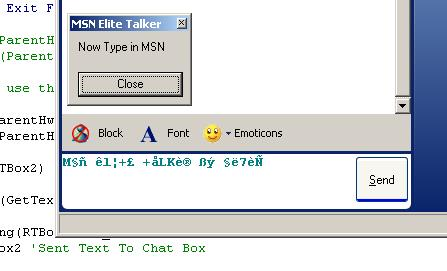



## Elite Talker For MSN

### Description

This will change your text in MSN just like you were typeing into an elite talker. Its easy to understand and is documented. Please vote and Leave your Comments!!. I will release another version with more features some time in the next coupple of weeks.
 
### More Info
 
dont use shift when your typeing because it screws up. i will try and fix this in the next version

             |
---                |---
**Submitted On**   |2002-02-03 21:56:24
**By**             |[�e7eN](https://github.com/Planet-Source-Code/PSCIndex/blob/master/ByAuthor/e7en.md)
**Level**          |Beginner
**User Rating**    |4.8 (24 globes from 5 users)
**Compatibility**  |VB 6\.0
**Category**       |[Miscellaneous](https://github.com/Planet-Source-Code/PSCIndex/blob/master/ByCategory/miscellaneous__1-1.md)
**World**          |[Visual Basic](https://github.com/Planet-Source-Code/PSCIndex/blob/master/ByWorld/visual-basic.md)
**Archive File**   |[Elite\_Talk543442102002\.zip](https://github.com/Planet-Source-Code/e7en-elite-talker-for-msn__1-31653/archive/master.zip)

